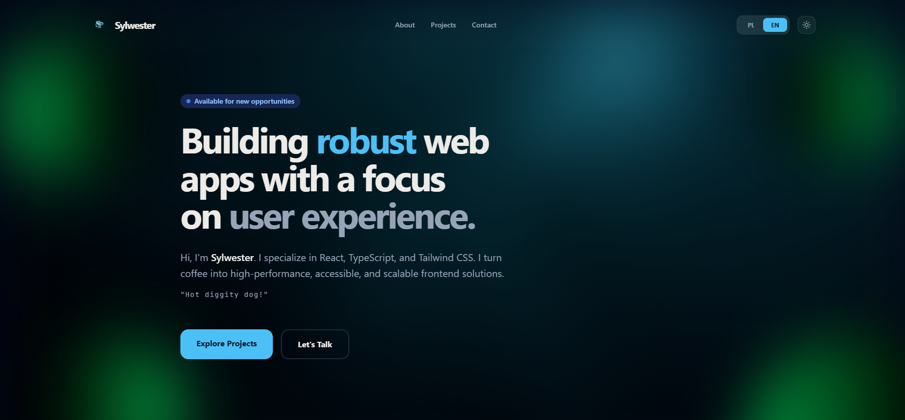

# 🚀 Personal Portfolio | Software Engineer

[](https://app.netlify.com/projects/sylwester-pyzik-portfolio/deploys)

<p align="center">
  
</p>

> **A high-performance, multilingual personal portfolio showcasing my engineering projects and tech stack.**  
> Built with a focus on **clean code**, **responsiveness**, and a **seamless user experience**.

---

## 🛠️ Tech Stack

| Category       | Technology                         |
| :------------- | :--------------------------------- |
| **Frontend**   | React 18, TypeScript, Vite         |
| **Styling**    | Tailwind CSS (Glassmorphism UI)    |
| **I18n**       | i18next (English & Polish support) |
| **Icons**      | Lucide React                       |
| **Deployment** | netlify                            |

---

## 🌟 Key Features

- **🌍 Multi-language Support** – Integrated `react-i18next` for instant language switching without page reloads.
- **🎨 Glassmorphism UI** – Modern, clean aesthetic with custom Tailwind CSS configurations, dynamic gradients, and backdrop blurs.
- **📱 Fully Responsive** – Optimized for a flawless experience across all devices, from mobile phones to 4K displays.
- **🚀 Performance Focused** – Leveraging Vite for lightning-fast HMR and optimized production asset bundling.
- **📂 Dynamic Project Gallery** – Automated rendering of projects from structured data, featuring image optimization and fallback states.

---

## ⚙️ Installation & Setup

1. Clone the repository:

   ```
   git clone [https://github.com/PSylwester/portfolio.git](https://github.com/PSylwester/portfolio.git)
   cd portfolio
   ```

2. Install dependencies:

   ```
   npm install
   ```

3. **Run development server:**

   ```
   npm run dev
   node server.js
   ```

4. **Build for production:**

   ```
   npm run build
   ```

---

## 💡 Why this stack?

This project was built to demonstrate my proficiency in **TypeScript**, ensuring type safety and maintainability in a modern frontend environment.

The choice of **Tailwind CSS** enabled the implementation of complex designs like Glassmorphism without sacrificing performance. Furthermore, the integration of **i18next** reflects an engineering mindset focused on global accessibility and scalable content management.

---

# My Portfolio

[](https://Sylwester-Pyzik-Portfolio.netlify.app)

## 👥 Author

- **Sylwester Pyzik** – [GitHub Profile](https://github.com/PSylwester)

---

<p align="center">
  Built with 💙 by Sylwester Pyzik
</p>
